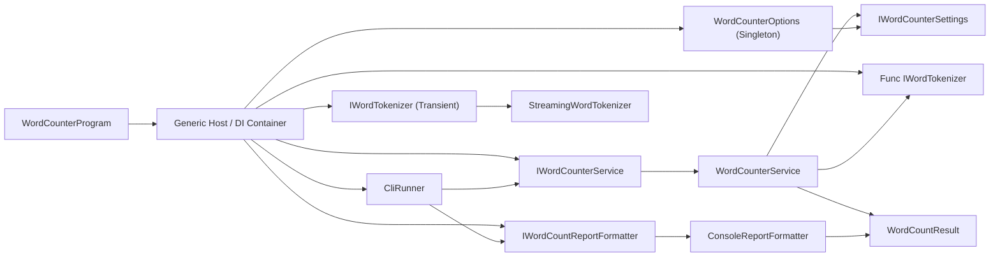

Given multiple text files, a C# program counts the occurrences of each unique word in the files and aggregates the results. The implementation is designed to minimize running time and memory usage, independent of the number of files or file size.

## Overview

This project provides a command-line application that efficiently processes large text files to generate word frequency statistics. The implementation uses modern C# features and best practices for performance and scalability.

## Key Features

- **Parallel File Processing**: Processes multiple files concurrently with bounded, configurable parallelism
- **Memory-Efficient Streaming**: Reads files in 64KB chunks to handle arbitrarily large files and lines without loading entire contents into memory
- **Word Integrity Preservation**: Words are assembled character-by-character and preserved across chunk boundaries
- **Runtime Tuning**: Supports environment-based tuning for chunk size and max parallelism
- **Thread-Safe Aggregation**: Uses `ConcurrentDictionary` for safe concurrent word count updates
- **Case-Insensitive Analysis**: Normalizes words to lowercase for accurate frequency counting
- **Robust Word Extraction**: Uses streaming character tokenization for letters, digits, and underscore
- **Comprehensive Statistics**: Displays total unique words, total occurrences, and top 50 words by frequency

## Performance Optimizations

1. **Chunk-Based Streaming**: Files are processed in 64KB chunks rather than loading entire contents into memory
2. **Buffered Reading**: Uses 64KB buffer size for optimal I/O performance with large files
3. **Parallel Processing**: Files are processed concurrently with `Parallel.ForEachAsync` using configurable bounded parallelism
4. **Streaming Tokenization**: Character-by-character parsing preserves word integrity across chunk boundaries without regex overhead
5. **Concurrent Dictionary**: Thread-safe word count aggregation without explicit locking
6. **Lazy Evaluation**: Results are sorted only once after all processing is complete

## Building the Project

### Requirements
- .NET 10.0 SDK or later (`dotnet --version`)
- NuGet restore access (internet or an internal package feed) for first-time setup

### Initial Setup

```bash
# Restore all projects (app + tests)
dotnet restore WordCounter.sln
```

### Build Commands

```bash
# Build the project
dotnet build WordCounter.csproj

# Publish the executable
dotnet publish -c Release WordCounter.csproj
```

## Usage

### Basic Usage

```bash
# Process single file
dotnet run --project WordCounter.csproj -- sample1.txt

# Process multiple files
dotnet run --project WordCounter.csproj -- sample1.txt sample2.txt sample3.txt

# Process with globbing (shell expansion)
dotnet run --project WordCounter.csproj -- *.txt
```

### Optional Runtime Configuration

```bash
# Override chunk size (bytes)
export WORD_COUNTER_CHUNK_SIZE=131072

# Override max number of files processed in parallel
export WORD_COUNTER_MAX_PARALLELISM=16
```

### Running the Executable

```bash
# After publishing
./bin/Release/net10.0/WordCounter sample1.txt sample2.txt sample3.txt
```

## Example Output

```
Processing 3 file(s)...

Total unique words: 15
Total word occurrences: 19

Word Counts (Top 50 by frequency):
--------------------------------------------------
Word                                     Count
--------------------------------------------------
do                                           3
that                                         2
well                                         2
and                                          1
go                                           1
i                                            1
many                                         1
more                                         1
not                                          1
so                                           1
thing                                        1
things                                       1
very                                         1
word                                         1
you                                          1
```

## Algorithm Description

### Word Counting Algorithm

1. **File Reading**: Each file is processed asynchronously with chunk-based streaming
   - Uses `StreamReader` with UTF-8 encoding and 64KB buffer
   - Reads fixed 64KB chunks to handle arbitrarily long lines
   - Assembles words character-by-character across chunk boundaries
   - Skips empty/whitespace-only chunks for efficiency

2. **Word Extraction**: Chunk content is tokenized character-by-character
   - Word characters: letters, digits, and underscore (`_`)
   - Non-word characters flush the current token
   - Case normalization with `ToLowerInvariant()`

3. **Aggregation**: Word counts are updated in concurrent dictionary
   - `AddOrUpdate()` atomically increments counts
   - No lock contention due to concurrent dictionary implementation

4. **Results**: Final results are sorted by frequency (descending) then alphabetically

### Time Complexity

- **Per File**: O(n) where n = total characters in file
- **Overall**: O(n) for all files (with parallelization speedup)
- **Sorting Results**: O(k log k) where k = unique word count (typically much smaller than n)

### Space Complexity

- **File Buffer**: O(1) - fixed 64KB buffer regardless of file size
- **Word Storage**: O(k) where k = number of unique words
- **Total**: O(k) without loading entire files into memory

## File Structure

```
/
├── WordCounter.sln         # Solution file
├── WordCounter.csproj      # Project file
├── App/
│   ├── Program.cs          # Composition root
│   └── CliRunner.cs        # CLI orchestration and argument validation
├── Processing/
│   ├── WordCounterService.cs     # Core counting service
│   ├── StreamingWordTokenizer.cs # Chunk tokenizer preserving words across boundaries
│   └── WordCounterOptions.cs     # Runtime options/env configuration
├── Presentation/
│   └── ConsoleReportFormatter.cs # Console output formatter
├── Contracts/
│   ├── IWordCounterService.cs      # Service abstraction
│   ├── IWordTokenizer.cs           # Tokenizer abstraction
│   ├── IWordCountReportFormatter.cs # Formatter abstraction
│   ├── IWordCounterSettings.cs     # Settings abstraction
│   └── WordCountResult.cs          # Result model
├── WordCounter.Tests/      # Test project
│   ├── WordCounter.Tests.csproj
│   ├── StreamingWordTokenizerTests.cs
│   ├── WordCounterServiceTests.cs
│   └── WordCounterIntegrationTests.cs
├── README.md               # This file
├── sample1.txt             # Sample test file
├── sample2.txt             # Sample test file
└── sample3.txt             # Sample test file
```

## Architecture

The application uses .NET Generic Host as the composition root in [App/Program.cs](App/Program.cs), with dependency injection for wiring core components.

### DI registrations (Program)

- `WordCounterOptions` as singleton (loaded from environment)
- `IWordTokenizer` -> `StreamingWordTokenizer` as transient (fresh tokenizer instance per factory invocation)
- `Func<IWordTokenizer>` factory delegate for `WordCounterService`
- `IWordCounterService` -> `WordCounterService` as singleton
- `IWordCountReportFormatter` -> `ConsoleReportFormatter` as singleton
- `CliRunner` as singleton

### Why tokenizer is transient + factory-based

- `StreamingWordTokenizer` is stateful and not thread-safe
- A new tokenizer instance is required per processed file
- The `Func<IWordTokenizer>` factory guarantees each file processing path gets its own tokenizer instance

## Testing

Run the program with the provided sample files:

```bash
dotnet run --project WordCounter.csproj -- sample1.txt sample2.txt sample3.txt
```

Run the automated tests:

```bash
dotnet test WordCounter.sln
```

Test project dependencies are restored automatically during `dotnet restore` / `dotnet test`.

## Scalability Considerations

- **Handles Large Files**: Chunk-based streaming keeps memory usage constant regardless of file size
- **Handles Many Files**: Parallel processing divides work across CPU cores
- **Handles Arbitrarily Long Lines**: Streaming tokenization handles lines of any length without memory issues
- **Graceful Degradation**: Error handling allows processing to continue even if some files fail

## Error Handling

- Invalid file paths are skipped with a warning
- File I/O errors are caught and reported without stopping entire process
- Encoding errors are handled gracefully (UTF-8 with fallback support)

## Dependencies

### Runtime (WordCounter)

- .NET 10.0 runtime/SDK
- `Microsoft.Extensions.Hosting` `10.0.0`
- `Microsoft.Extensions.DependencyInjection` `10.0.0`
- Uses only built-in .NET libraries:
  - `System.IO` - File streaming and buffered reading
  - `System.Collections.Concurrent` - Thread-safe ConcurrentDictionary
   - `System.Text` - Incremental token buffering with StringBuilder
  - `System.Threading.Tasks` - Asynchronous and parallel processing

### Test Project (WordCounter.Tests)

- `Microsoft.NET.Test.Sdk` `17.14.1`
- `xunit` `2.9.3`
- `xunit.runner.visualstudio` `3.1.4`
- `coverlet.collector` `6.0.4`

### Dependencies diagram

